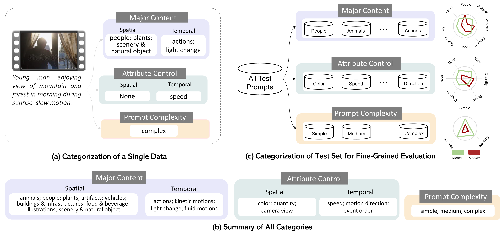
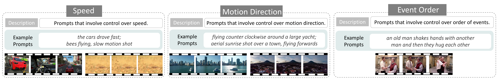
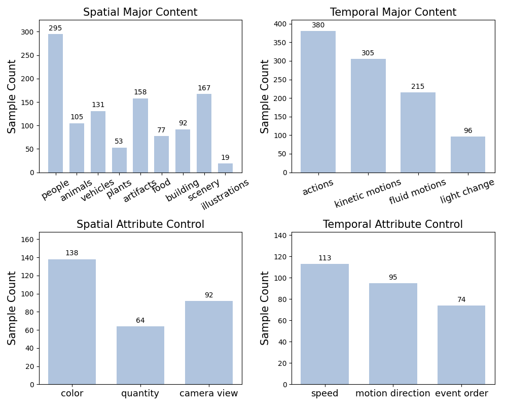
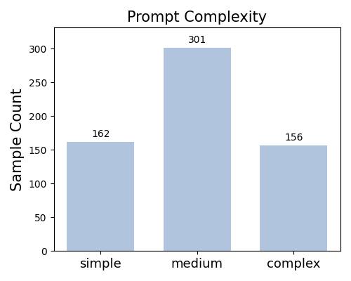
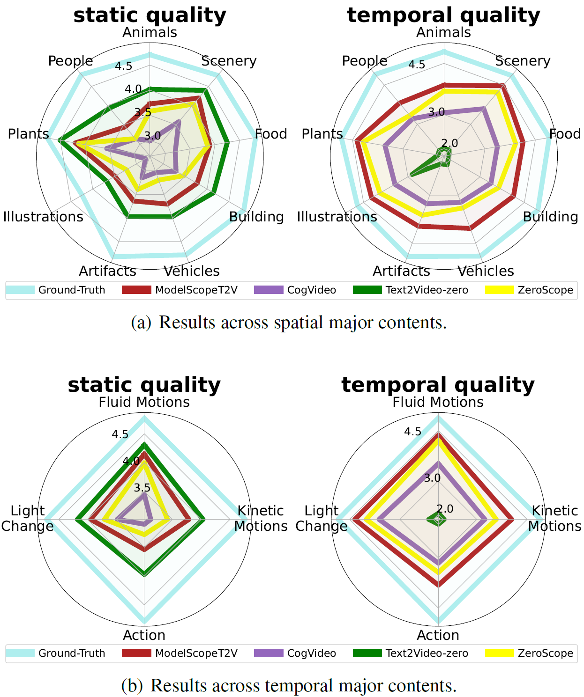
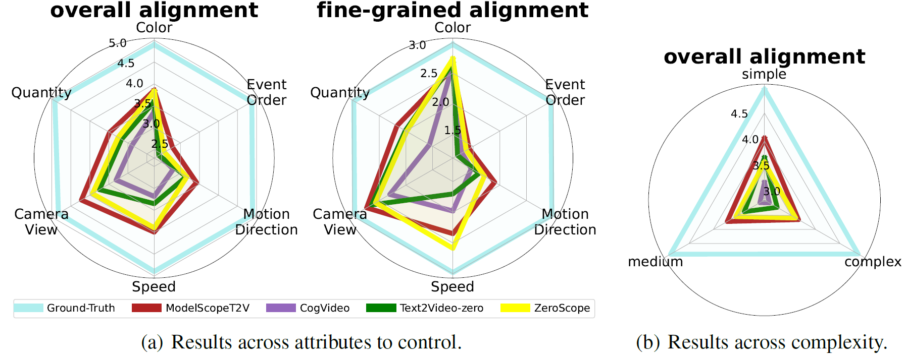
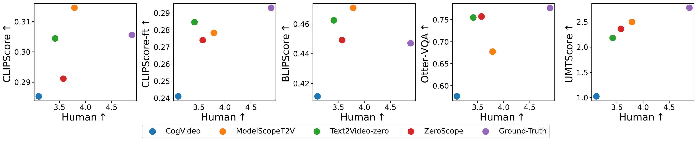
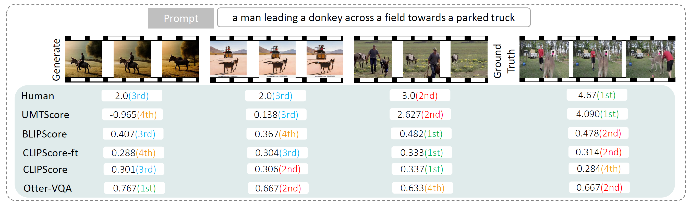
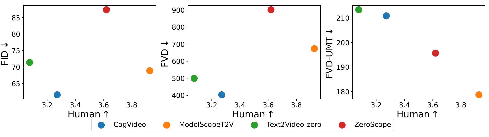

# FETV: A Benchmark for Fine-Grained Evaluation of Open-Domain Text-to-Video Generation
<div align="center">
    <a href='https://arxiv.org/abs/2311.01813'></a>
    <a href='https://huggingface.co/datasets/lyx97/FETV'></a>
</div>

<div>
<div align="center">
    <a href='https://llyx97.github.io/' target='_blank'>Yuanxin Liu<sup>1</sup></a>&emsp;
    <a href='https://leili.site/' target='_blank'>Lei Li<sup>1</sup></a>&emsp;
    <a href='https://renshuhuai-andy.github.io/' target='_blank'>Shuhuai Ren<sup>1</sup></a>&emsp;
    RunDong Gao<sup>1</sup>&emsp;
    <a href='https://lscpku.github.io/' target='_blank'>Shicheng Li<sup>1</sup></a>&emsp;
    </br>
    <a href='https://pkucss.github.io/' target='_blank'>Sishuo Chen<sup>1</sup></a>&emsp;
    <a href='https://xusun.org/' target='_blank'>Xu Sun<sup>1</sup></a>&emsp;
    <a href='https://houlu369.github.io/' target='_blank'>Lu Hou<sup>2</sup></a>
</div>
<div>
<div align="center">
    <sup>1</sup>Peking University&emsp;
    <sup>2</sup>Huawei Noah’s Ark Lab
    
</div>

## News 🚀
**[2023-12]**
    - Release evaluation code to [FETV-EVAL](https://github.com/llyx97/FETV-EVAL).
**[2023-11]**
    - Update more detailed information about FETV data and evaluation results.

## Overview
- [The **FETV** benchmark](#fetv)
- [Manual evaluation of T2V generation models](#manual_eval)
- [Diagnosis of automatic T2V generation metrics](#auto_eval)


## <span id="fetv"> FETV Benchmark </span>
FETV consist of a diverse set of text prompts, categorized based on three orthogonal aspects: **major content**, **attribute control**, and **prompt complexity**. This enables fine-grained evaluation of T2V generation models.


### Data Instances
All FETV data are all available in the file `fetv_data.json`. Each line is a data instance, which is formatted as:
```
{
  "video_id": "1006807024", 
  "prompt": "A mountain stream", 
  "major content": {
       "spatial": ["scenery & natural objects"], 
       "temporal": ["fluid motions"]
     }, 
  "attribute control": {
      "spatial": null, 
      "temporal": null
    }, 
  "prompt complexity": ["simple"], 
  "source": "WebVid", 
  "video_url": "https://ak.picdn.net/shutterstock/videos/1006807024/preview/stock-footage-a-mountain-stream.mp4",
  "unusual type": null
  }
```
**Temporal Major Contents**

**Temporal Attributes to Control**

**Spatial Major Contents**

**Spatial Attributes to Control**


### Data Fields
* "video_id": The video identifier in the original dataset where the prompt comes from.
* "prompt": The text prompt for text-to-video generation.
* "major content": The major content described in the prompt.
* "attribute control": The attribute that the prompt aims to control.
* "prompt complexity": The complexity of the prompt.
* "source": The original dataset where the prompt comes from, which can be "WebVid", "MSRVTT" or "ours".
* "video_url": The url link of the reference video.
* "unusual type": The type of unusual combination the prompt involves. Only available for data instances with `"source": "ours"`.

### Dataset Statistics
FETV contains 619 text prompts. The data distributions over different categories are as follows (the numbers over categories do not sum up to 619 because a data instance can belong to multiple categories)



## <span id="manual_eval"> Manual Evaluation of Text-to-video Generation Models </span>
We evaluate four T2V models, namely [CogVideo](https://github.com/THUDM/CogVideo), [Text2Video-zero](https://github.com/Picsart-AI-Research/Text2Video-Zero), [ModelScopeT2V](https://modelscope.cn/models/damo/text-to-video-synthesis/summary) and [ZeroScope](https://huggingface.co/cerspense/zeroscope_v2_576w). The generated and ground-truth videos are manually evaluated from four perspectives: **static quality**, **temporal quality**, **overall alignment** and **fine-grained alignment**. Examples of generated videos and manual ratings can be found [here](https://github.com/llyx97/FETV/tree/main/generated_video_examples)

**Results of static and temporal video quality**


**Results of video-text alignment**


## <span id="auto_eval"> Diagnosis of Automatic Text-to-video Generation Metrics </span>
We develop automatic metrics for video quality and video-text alignment based on the [UMT](https://github.com/opengvlab/unmasked_teacher) model, which exhibit higher correlation with humans than existing metrics.

**Video-text alignment ranking correlation with human**

**Video-text alignment ranking example**

**Video quality ranking correlation with human**



## Todo
- [x] Upload evaluation codes.

## License
This dataset is under [CC-BY 4.0](https://creativecommons.org/licenses/by/4.0/) license.

## Citation
```bibtex
@article{liu2023fetv,
  title   = {FETV: A Benchmark for Fine-Grained Evaluation of Open-Domain Text-to-Video Generation},
  author  = {Yuanxin Liu and Lei Li and Shuhuai Ren and Rundong Gao and Shicheng Li and Sishuo Chen and Xu Sun and Lu Hou},
  year    = {2023},
  journal = {arXiv preprint arXiv: 2311.01813}
}
```
